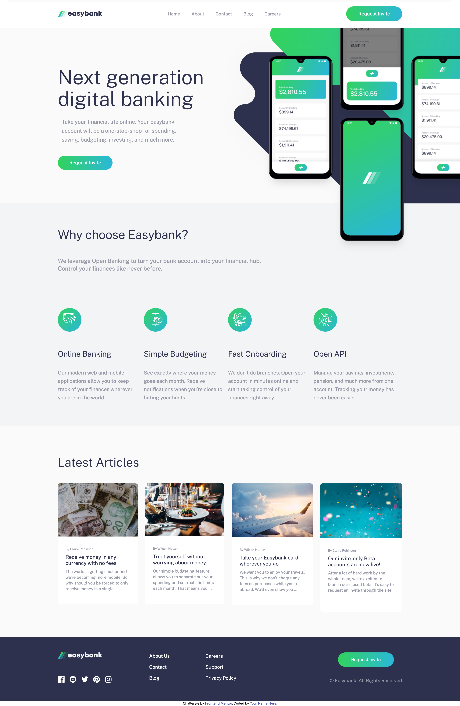

# Easy-Bank-Landing-Page
Intermediate level project from Frontend Mentor Website

- Live Site URL: [Add live site URL here](https://ryoshi1001.github.io/Easy-Bank-Landing-Page/)

Built with:
- Semantic HTML5 markup
- CSS custom properties
- TailwindCss
- JavaScript
- Flexbox
- Mobile-first workflow

Fun Learning/Practicing: 
- Javascript DOM manipulation
- Responsive breakpoints in TailwindCSS
- Mobile menu navigation animation
- Adding custom screens to themes and colors in content to tailwind.config.js file

The designs were created to the following widths:
- Mobile: 375px
- Desktop: 1440px

## Colors
  DarkBlue: '#2d314d',
  LimeGreen: '#31d35c',
  BrightCyan: '#2bb7da',
  GrayBlue: '#9698a6',
  LightGrayishBlue: '#f3f4f6',
  VeryLightGray: '#fafafa',
  White: '#ffffff',

## Typography
- Family: [Public Sans](https://fonts.googleapis.com/css2?family=Public+Sans:wght@300;400;700&display=swap)
- Weights: 300, 400, 700 
# Easy-Bank-Landing-Page

